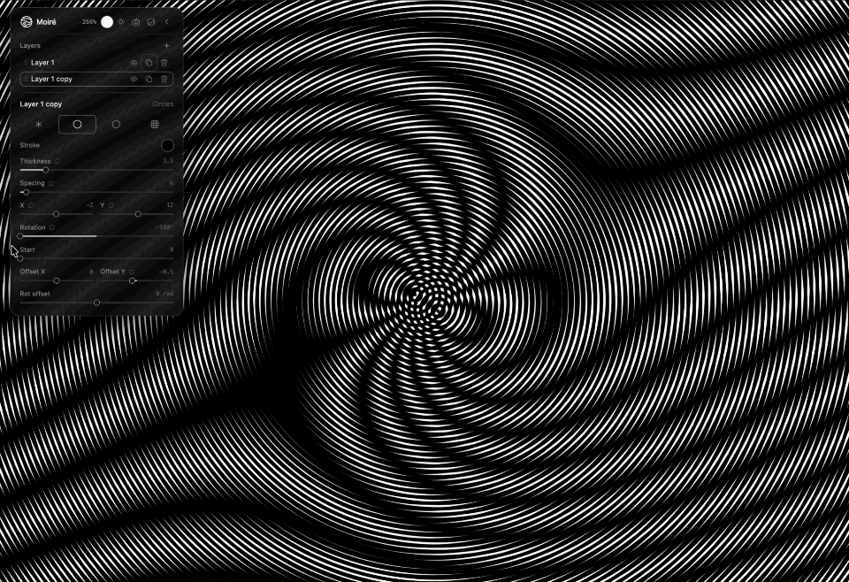

# Moiré

<p align="center">
  
</p>

<p align="center">
  A canvas-first WebGPU studio for interference fields.<br>
  <a href="https://neovand.github.io/Moire/"><strong>Open the live studio</strong></a>
</p>

<p align="center">
  
  
  
  
  
  
  
  
  
</p>

Two similar periodic figures—lines, concentric shapes, or lattices—overlay to make a new figure. Moiré is a full-bleed canvas with one studio on the left. Add layers, drag them, and watch the interference write itself.

## Fields, not drawings

This is not a pile of SVG paths. Nothing here is a list of rings the GPU then strokes. Each layer is a **scalar field**: every pixel asks how far it is from the nearest member of a family, and ink appears where that distance is smaller than half the stroke.

That is also why it is fast. An SVG of the same scene would be a nightmare. Zoom out and a family has no last ring — you would emit thousands of path elements per layer, the painter would still not *be* the interference, and a drag would rebuild the tree. A field does not grow with `n`. Cost is pixels times layers: one fullscreen program, every pixel in parallel. Twelve layers at an arbitrary zoom is still one pass. The moiré is not a post-effect. It is two answers that disagree.

A family is indexed by an integer `n`. Ring `n` has radius `n * spacing + phase`. If the layer is translated or rotated, the center walks with `n` too — `rotate(n · δ, n · θ)` — then the sample is unrotated back into that ring’s frame. Two of those fields, slightly out of step, *are* the moiré. The interference is not composited after the fact; it is what you see when two answers disagree.

```ts
function evalRing(p, n, offset, theta, spacing, phase, shape, sides) {
  const radius = n * spacing + phase;
  const center = rotate2d({ x: offset.x * n, y: offset.y * n }, n * theta);
  const q = rotate2d({ x: p.x - center.x, y: p.y - center.y }, -n * theta);
  return Math.abs(shapeRadius(q, shape, sides) - radius);
}
```

`shapeRadius` is the metric for that family: Euclidean length for circles, `max(|x|, |y|)` for squares, the regular-polygon radial metric for triangles and n-gons.

## Which ring?

`evalRing` answers one ring. The real question is *which* `n` is nearest, and that is where offsets used to cost you the frame. Guess `n ≈ |p| / spacing` and sweep a fixed number of neighbours, and you are wrong twice: the true nearest ring can be dozens of indices away, and you pay the full sweep at every pixel anyway. Wrong in a specific, ugly way — the pixels that miss form arcs, so whole sides of whole rings go white when you zoom out.

Every one of those metrics is a **support function**, `shapeRadius(q) = max_k q·n_k` over the shape's outward normals, and that single fact hands you the four constants the problem needs:

- **1-Lipschitz**, so the residual `h(n) = shapeRadius(qₙ) − (n·s + φ)` can only change by `Λ = s + |δ| + |θ|·|p|` per index. From a sample `v` away, a whole run of `(v − best)/Λ` indices is provably not the answer — sphere tracing, in index space.
- **`shapeRadius(q) ≥ κ·|q|` with `κ = cos(π/N)` exactly**, which bounds how far a rotation can fan the nearest index away from `|p| / spacing`.
- **Subadditive**, so a ring's boundary outruns its own radius at exactly `m = shapeRadius(−δ)` per index — not `|δ|`. For a triangle that is a factor of two, and the loose version declares whole bands of ordinary settings unsolvable.
- **A max of linear forms**, so with `θ = 0` the residual is convex and piecewise linear in `n`: one segment per facet. The crossing is a linear solve on one facet, for any side count. When `m == s` that segment goes *flat* — every far ring is equally close — and no sweep of any length can find it. One comparison can.

Together the first three give a closed interval `[nLo, nHi]` that provably contains every ring passing within half a stroke of the pixel, so the minimum over the interval *is* the answer. Notably `θ` does not appear in it: rotation destroys the closed form but does not widen the search. The scan then skips most of the interval, carries `cos`/`sin` and the offset incrementally instead of recomputing them, and calls no transcendental in the loop at all.

Net effect: rotation and translation offsets are 10–40× cheaper on the GPU than the sweep they replaced, and agree with brute force pixel-for-pixel. Drag them freely. `paper/` has the write-up, the proofs, and the experiments.

Dispatch is cheapest-sufficient: centered layers collapse to a `mod`; circles ignore `θ` when `δ = 0`, since spinning a radial metric is a no-op; translated circles solve a quadratic; translated polygons take the closed form; everything else takes the bounded scan. There is no `maxRings`.

The same functions exist twice, on purpose: TypeScript in `src/gpu/inverseCpu.ts` and WGSL in `src/gpu/inverse.wgsl.ts`. Three.js `wgslFn` only parses the first `fn` in a string, so each helper is its own include. Tests lock the twins against brute force, including the marginal drift: `node --experimental-strip-types src/gpu/inverseCpu.test.ts`.

Stroke width is also a field test. `halfT = max(thickness / 2, 1.15 · pixel)` so a hairline stays a hairline at any zoom, instead of peppering into gaps. It doubles as the solver's guard: any distance past it renders identically, which is what makes the interval finite. Twelve layer slots are compiled once; hide or delete writes `active = 0` into the same uniforms.

## Patterns

| Family | What it draws |
| --- | --- |
| **Lines** | Parallel strokes, or radial strokes through the layer origin |
| **Concentric** | Circles, squares, triangles, or hexagons |
| **Grid** | Square, hex, or triangle lattices — vertices, optional edges, Scale X/Y |
| **Curves** | Sine waves, parabolas, hyperbolas, or Archimedean spirals |

Hex grid edges are hexagon sides, not three-line families. Grids have no offset.

## Studio

- Drag moves the selected layer. **Option-drag** rotates around the world origin.
- Space or middle-drag pans. Wheel zooms to the cursor. Shift on a slider is fine control.
- `I` collapses the studio to a mark. `E` exports a PNG. `F` resets the view.
- `1`–`9` select a layer. `H` hides it. `D` duplicates. `⌫` removes.
- Click the mark for a short note on the effect. `?` lists shortcuts.

The studio is dark. The canvas defaults to white. Pattern colors are the only accent.

## Projects, motion, and capture

The folder icon opens the library. Projects live in the browser's IndexedDB and
save themselves as you work; a scene is the same JSON the export panel writes, so
a project and a file are the same thing said twice.

Every slider has a play button beside its reset. It opens a panel that says what
the knob does over time — an interval, a period, loop or bounce or once, an
easing, and where in the cycle it starts — drawn as the curve it will actually
follow. Animations are pure functions of one clock, never accumulated, which is
why scrubbing lands exactly where you put it and why two knobs sharing a timing
never drift apart.

The camera icon captures. Stills at 1/2/4× and any aspect; frame sequences
straight into a folder you pick; MP4 or WebM up to 4K and 120 fps, encoded in the
page. A recording is not a screen capture: it asks for frame *n* at exactly
`t₀ + n/fps`, renders it, and waits for the pixels, so the file plays at the rate
it claims however fast the machine drew it, and the same range recorded twice is
the same file twice. The range it offers is the least common multiple of every
animation's cycle — the shortest clip that loops without a join.

## Develop

```bash
git clone https://github.com/NeoVand/Moire.git
cd Moire
npm install
npm run dev
```

Open `http://localhost:5173`. `npm run build` writes `dist/`.

Needs a browser with [WebGPU](https://gpuweb.github.io/gpuweb/). Inverse math is kept as CPU and WGSL twins; run `node --experimental-strip-types src/gpu/inverseCpu.test.ts`.

## Paper

`paper/` holds a write-up of the ring-inversion method — the support-function bound, the index interval, the Lipschitz skip, the closed form for translated polygons — with every figure and number generated from this repository. `paper/README.md` has the build and reproduction steps. Nothing in `paper/` is imported by the app.

## License

MIT. Designed and created by [Neo Mohsenvand](https://neovand.github.io/).
