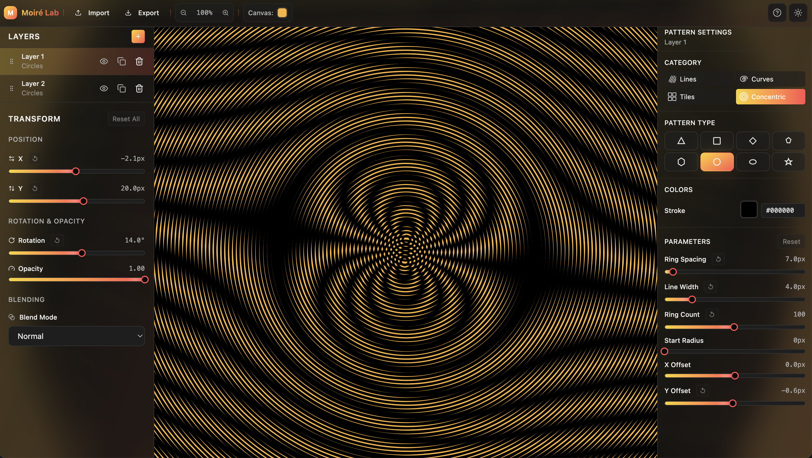

# 🌊 Moiré Pattern Generator

**A sophisticated, interactive Moiré pattern generator that transforms mathematical interference into mesmerizing visual art.**

Built with React, TypeScript, and mathematical precision - create stunning interference patterns with professional-grade tools and real-time interaction.



---

## ✨ What Makes This Special

🎯 **Mathematically Accurate** - Built on proper Moiré interference theory with beat frequency calculations  
🎨 **Artistically Powerful** - 16 pattern types from classic lines to complex hexagonal grids  
⚡ **Real-time Interactive** - 60fps rendering with instant parameter updates  
🖱️ **Intuitive Controls** - Professional UI with direct canvas manipulation, trackpad zoom, and layer management  
🎛️ **Professional Tools** - Dual sidebars, precise sliders, color palettes, and blend modes  
📐 **High Resolution** - Export-ready patterns up to 8K resolution  

---

## 🚀 Quick Start

```bash
# Clone and install
git clone <repository-url>
cd Moire
npm install

# Start creating patterns
npm run dev
```

Open `http://localhost:5173` and start creating mesmerizing patterns immediately!

---

## 🎮 How to Create Stunning Patterns

### 1. **Layer Management** (Left Sidebar)
- **Add Layers**: Click `+` to add new pattern layers
- **Select & Edit**: Click any layer to make it active
- **Transform Controls**: Adjust position, rotation, and opacity
- **Blend Modes**: Choose how layers interact (Multiply, Screen, Overlay, etc.)

### 2. **Pattern Design** (Right Sidebar)
- **Choose Category**: Lines, Curves, Grids, or Concentric patterns
- **Select Pattern**: 16 types from simple lines to complex hexagonal tessellations
- **Fine-tune Parameters**: Spacing, thickness, phase, aspect ratios, and progressive offsets

### 3. **Interactive Canvas**
- **Zoom**: Use trackpad pinch or mouse wheel - zooms to cursor position
- **Pan**: Click and drag to move around your pattern
- **Direct Layer Control**: Option + drag to move selected layer, Option + Shift + drag to rotate
- **Interactive Help**: Press 'H' to toggle canvas controls help overlay
- **Real-time Updates**: Watch patterns transform as you adjust parameters

### 4. **Pro Tips for Amazing Results**
- **Small Rotations**: Try 1-5° differences between layers for classic moiré bands
- **Layer Colors**: Use contrasting colors to highlight interference patterns  
- **Fine Control**: Hold `Alt/Option` while dragging sliders for 10x precision
- **Reset Options**: Use individual reset buttons (↺) or "Reset All" for quick resets

---

## 🎨 Pattern Gallery

### **Lines & Grids**
Create classic moiré bands with line patterns and grid interference
- **Straight Lines**: Perfect parallel interference patterns
- **Rectangular Grid**: 2D grid moiré with crosshatch effects
- **Triangular Grid**: Mathematical tessellation with angular interference

### **Curves & Organic**
Flowing, natural-looking interference patterns
- **Sine Waves**: Undulating patterns with wave interference
- **Spirals**: Logarithmic and Archimedean spiral types
- **Wavy Lines**: Organic flowing patterns with adjustable amplitude

### **Concentric & Radial**
Circular patterns creating radial and hyperbolic effects with progressive offsets
- **Concentric Circles**: Classic target patterns with radial interference
- **Radial Lines**: Spoke patterns for kaleidoscopic effects
- **Concentric Shapes**: Triangles, squares, rhombus, pentagons, hexagons, ellipses, and 5-point stars
- **Progressive Offsets**: Create spiral and drift effects as patterns move outward

### **Advanced Scientific**
Patterns inspired by physics and materials science
- **Hexagonal Grids**: Graphene-inspired tessellations for twistronics simulation
- **Diamond Grids**: Crystal structure patterns
- **Noise Patterns**: Randomized interference for texture effects

---

## 🔬 The Science Behind Moiré

Moiré patterns demonstrate fundamental principles of wave interference:

**Beat Frequency Theory**: When two similar frequencies interfere, they create a much lower "beat" frequency - visible as the moiré pattern.

**Mathematical Formula**: `p_moiré ≈ (p₁ × p₂) / |p₁ - p₂|`

**Real-world Applications**:
- **Graphene Research**: Twisted bilayer graphene creates moiré superlattices
- **Optical Engineering**: Understanding aliasing and interference in imaging
- **Art & Design**: Creating optical illusions and dynamic visual effects
- **Education**: Demonstrating wave physics and frequency relationships

---

## 🛠️ Technical Excellence

### **Architecture**
```
🏗️ Modern React + TypeScript
⚡ Vite for lightning-fast development  
🎨 Tailwind CSS with custom design system
🖼️ Canvas2D with 60fps rendering
📱 Responsive design with trackpad support
```

### **Performance Features**
- **Real-time Rendering**: Smooth 60fps updates with complex patterns
- **Memory Efficient**: Optimized algorithms and proper cleanup
- **High DPI Support**: Crisp rendering on Retina displays
- **Gesture Support**: Native trackpad zoom and pan gestures

### **Code Quality**
- **Type Safety**: Full TypeScript coverage with strict mode
- **Component Architecture**: Modular, reusable design system
- **State Management**: Efficient React context with optimized updates
- **Build System**: Production-ready with automatic optimization

---

## 🎯 Use Cases

### **Artists & Designers**
- Create unique patterns for backgrounds, textures, and visual effects
- Generate high-resolution artwork up to 8K
- Explore mathematical beauty through interactive creation

### **Educators & Students**
- Demonstrate wave interference and beat frequencies
- Visualize mathematical concepts in real-time
- Interactive learning tool for physics and mathematics

### **Researchers**
- Simulate twistronics and material science phenomena
- Visualize frequency relationships and interference patterns
- Generate patterns for scientific publications

### **Creative Professionals**
- Design unique backgrounds and textures
- Create optical illusions and kinetic art
- Generate patterns for print and digital media

---

## 🚀 Advanced Features

### **Professional Layer System**
- **Multiple Layers**: Add unlimited pattern layers
- **Transform Controls**: Precise position, rotation, and opacity
- **Direct Canvas Manipulation**: Move and rotate layers directly on canvas with modifier keys
- **Blend Modes**: 12 different blending options for complex effects
- **Layer Management**: Visibility, locking, duplication, and deletion

### **Precision Controls**
- **Fine Adjustment**: Alt+drag for 10x finer control
- **Decimal Values**: Precise parameter control with decimal stepping
- **Extended Ranges**: Ring counts up to 200, aspect ratios from 0.1-10
- **Reset Options**: Individual and bulk reset functionality
- **Real-time Preview**: Instant feedback for all parameter changes

### **High-Quality Output**
- **Multiple Resolutions**: From 400×300 to 8K (7680×4320)
- **Print Formats**: A4, A3 at 300 DPI
- **Specialty Sizes**: Ultra-wide, cinema, and square formats
- **Retina Support**: Crisp rendering on high-DPI displays

### **Professional UI/UX**
- **Dual Sidebars**: Organized layer management and pattern controls
- **Unified Navigation**: Clean header with all essential controls
- **Theme Support**: Beautiful light and dark themes
- **Accessibility**: Keyboard navigation and screen reader support

---

## 🎮 Keyboard Shortcuts & Gestures

### **Canvas Interactions**
- **Zoom**: Mouse wheel or trackpad pinch → zooms to cursor position
- **Pan**: Click and drag → move around the canvas
- **Move Layer**: `Option + Drag` → move selected layer position
- **Rotate Layer**: `Option + Shift + Drag` → rotate selected layer (up = CCW, down = CW)

### **Interface Controls**
- **Fine Control**: Hold `Alt/Option` + drag sliders → 10x precision
- **Help Toggle**: Press `H` → show/hide canvas controls help
- **Tab Navigation**: Navigate through all controls
- **Enter/Space**: Activate buttons and controls
- **Arrow Keys**: Fine-tune slider values when focused

---

## 🔮 Roadmap

### **Phase 5: Export System** (Next)
- [ ] High-resolution PNG export with custom sizing
- [ ] SVG export for vector graphics workflows
- [ ] Batch export for animation frames
- [ ] Print-ready formats with color profiles

### **Phase 6: Animation** (Future)
- [ ] Keyframe-based animation system
- [ ] Timeline interface for complex animations
- [ ] GIF and video export capabilities
- [ ] Preset animation templates

### **Phase 7: Advanced Features** (Future)
- [ ] WebGL upgrade for GPU acceleration
- [ ] Custom mathematical function support
- [ ] Preset gallery with famous patterns
- [ ] Collaborative sharing and pattern library

---

## 🤝 Contributing

We welcome contributions! Areas where you can help:

- **Export Features**: Implement PNG/SVG export functionality
- **Animation System**: Build keyframe animation tools
- **Pattern Library**: Create preset galleries and templates
- **Performance**: WebGL optimization for complex patterns
- **Documentation**: Improve tutorials and educational content

---

## 📚 Learn More

### **Mathematical Background**
- [Moiré Pattern Theory](https://en.wikipedia.org/wiki/Moir%C3%A9_pattern)
- [Beat Frequency Visualization](https://en.wikipedia.org/wiki/Beat_(acoustics))
- [Twistronics Research](https://en.wikipedia.org/wiki/Twisted_bilayer_graphene)

### **Creative Inspiration**
- [Optical Art Movement](https://en.wikipedia.org/wiki/Op_art)
- [Bridget Riley's Work](https://www.bridgetriley.org/)
- [Mathematical Art](https://www.mathartfun.com/)

---

## 📄 License

MIT License - Open source for learning, creativity, and research.

---

<div align="center">

**🌊 Experience the Mathematical Beauty of Interference Patterns**

*Perfect for artists, educators, researchers, and anyone fascinated by the intersection of mathematics and visual beauty.*

[**�� Try It Now**](http://localhost:5173) • [**📖 Documentation**](#) • [**🐛 Report Issues**](#) • [**⭐ Star on GitHub**](#)

</div>

---

> *"Moiré patterns reveal the hidden mathematics in everyday interference, transforming simple overlapping structures into complex, mesmerizing visual phenomena."*
