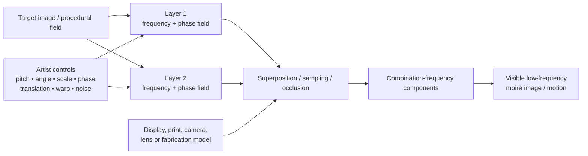
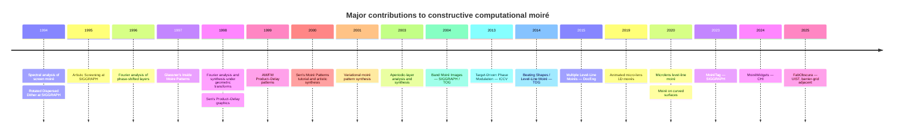

# Moiré Patterns in Computer Graphics: Generation, Interaction, and Aesthetic Image Synthesis

## Executive summary

Moiré occupies an unusual position in computer graphics: most rendering and image-processing research treats it as an aliasing artifact to suppress, while a much smaller but technically rich literature treats the same phenomenon as a **constructive image-formation mechanism**. The most important constructive lineage runs from Fourier/sampling analyses of superposed screens in the 1990s, through SIGGRAPH/TOG work on **band moiré images**, to inverse-design methods such as **target-driven phase modulation**, then to **level-line “beating” images**, multiplexed moirés, microlens implementations, curved-surface fabrication, and, more recently, interactive tangible interfaces. citeturn27view0turn26search2turn2view2turn29search0turn37search2

The central computational insight is simple but powerful. Two high-frequency layers can contain spectral components whose **difference frequency** is much lower than either layer. If the relative frequencies, orientations, and phases are controlled, that low-frequency component becomes the visible moiré. Consequently, the fundamental design parameters are not only line pitch and angle, but also **relative phase fields**. Modern constructive methods exploit this by placing the desired image in the phase relationship between two otherwise innocuous gratings. Tsai and Chuang's ICCV 2013 work is the clearest inverse-design formulation: given a target grayscale image, it solves for two curvilinear gratings whose \((1,-1)\) interference component reconstructs the target. citeturn2view2turn27view0

For aesthetic graphics, four papers are especially important. Andrew Glassner's 1997 IEEE CG&A article made controllable moiré accessible as recreational/procedural computer graphics; Hersch and Chosson's **Band Moiré Images** at SIGGRAPH 2004 made images and animation-like effects explicitly designable; Tsai and Chuang's **Target-Driven Moiré Pattern Synthesis by Phase Modulation** at ICCV 2013 turned target-image reproduction into an optimization problem; and Chosson and Hersch's **Beating Shapes Relying on Moiré Level Lines** in TOG 2014 introduced a particularly expressive contour/elevation formulation for shapes that appear to “beat” when layers move. citeturn30search1turn26search2turn2view2turn29search0

A second lineage comes from digital halftoning. **Rotated Dispersed Dither** and **Artistic Screening** at SIGGRAPH 1994/1995 show that periodic screening can be designed rather than merely tolerated; Artistic Screening, in particular, gives artists control over screen-element contours and geometric mappings and was explicitly intended to create artistic printed imagery. It is not itself a moiré-synthesis algorithm, but it provides important machinery for controlling the high-frequency layers from which moiré can emerge. citeturn14search0turn14search3turn14search10

A third lineage turns static graphics into **physical interaction**. Level-line and band moirés inherently provide passive animation because translation, rotation, tilt, or viewpoint change modifies the decoded low-frequency image without electronics. Later work implemented these structures with cylindrical microlenses and on curved surfaces. MoiréTag at SIGGRAPH 2023 and MoiréWidgets at CHI 2024 invert the relationship again: instead of using motion to create art, they use the amplified phase motion as a high-precision input signal. MoiréWidgets reports sub-millimeter interaction sensing at a camera distance of 100 cm and provides a Processing-based pattern-generation/preview workflow. citeturn37search18turn37search2turn37search1turn22search1turn36search4

The most conspicuous research gap is **interactive, GPU-native aesthetic authoring**. In the high-quality literature reviewed here, intentional moiré synthesis is dominated by offline analytic construction, optimization, printing, and fabrication; I did not identify a major SIGGRAPH/TOG/Eurographics/TVCG paper whose principal contribution is a node-based or shader-based real-time moiré art editor. This is striking because classical grating models are exceptionally well suited to fragment/compute shaders. The closest recent authoring model is the moiré-adjacent **FabObscura** system at UIST 2025, which parameterizes barrier-grid animations as mathematical functions and couples a pattern editor with interactive visualization and fabrication. citeturn30search1turn2view2turn36search2

The strongest future research opportunity is therefore to combine three strands that currently remain largely separate: **phase-based inverse design**, **real-time GPU proceduralism**, and **modern interactive design tools**. A differentiable, fabrication-aware, perceptually optimized moiré renderer could let an artist specify a target image or motion, manipulate frequency/phase fields directly, receive real-time previews under print/display/camera simulation, and export either shaders, raster layers, vector gratings, or fabrication geometry. The literature already supplies most of the mathematical ingredients; what is missing is the integrated graphics system. citeturn2view2turn29search0turn37search2turn36search2

## Scope, foundations, and literature landscape

This review treats **constructive moiré** as the deliberate generation or control of visually salient patterns arising from superposition, sampling, phase difference, or closely related layered occlusion. Pure optical metrology, strain measurement, refractive-index measurement, ophthalmic optics, and camera demoiréing are excluded unless their algorithms directly contribute to graphics synthesis, computational printing, fabrication, or interaction. This criterion admits a small number of JOSA/Optics Express papers because they directly formulate moiré *synthesis* or fabricate computationally designed graphical moiré imagery; EPFL's own moiré publication archive makes the progression from spectral theory to synthesis, security graphics, band imagery, and level-line systems especially clear. citeturn27view0

The direct constructive literature is not evenly distributed among the venues named in the question. The strongest graphics contributions occur in **SIGGRAPH/ACM TOG**, with important work also in **IEEE CG&A**, **ICCV**, **Computers & Graphics**, and more recently **CHI/UIST** for interactive systems. Foundational synthesis mathematics appears disproportionately in imaging/printing journals such as JOSA A and the Journal of Electronic Imaging. By contrast, mainstream rendering and visualization research more often treats moiré as an undesirable sampling artifact: for example, EWA Splatting explicitly addresses aliasing and moiré arising when continuous image signals are discretized, while recent TVCG texture-design work also describes moiré-like “vibratory” structure as something that can impair a visualization. citeturn24search7turn24search8

### Why phase is the unifying design variable

For two locally periodic layers, a useful conceptual model is

\[
L_1(x)=f_1(\omega_1 x+\phi_1(x)),\qquad
L_2(x)=f_2(\omega_2 x+\phi_2(x)).
\]

Multiplication, opacity compositing, or sampling produces combination-frequency terms. A prominent term has approximately

\[
\omega_m=\omega_1-\omega_2,\qquad
\phi_m(x)=\phi_1(x)-\phi_2(x).
\]

When \(\omega_1\) and \(\omega_2\) are close, \(\omega_m\) is low and therefore visible as a much larger structure. The Fourier analyses by Amidror and Hersch formalized how phase shifts and geometric transformations move these moiré components, and Tsai and Chuang explicitly built their synthesis algorithm around the fundamental \((1,-1)\) combination component. citeturn27view0turn2view2

This perspective also explains why a tiny physical motion can produce a large visual movement. A small translation modifies the phase of the fine grating; because the decoded moiré has a much longer spatial period, that phase change appears as an amplified displacement. Band moirés exploit it visually, level-line moirés turn it into moving contours, and MoiréTag/MoiréWidgets exploit the same amplification for sensing. citeturn26search2turn29search0turn37search1turn22search1

The decisive distinction for interactive graphics is between **authoring time** and **playback time**. Many moiré systems are computationally offline but physically instantaneous: once two printed or fabricated layers exist, moving them yields animation with essentially no computational latency. This property is central to Band Moiré, Beating Shapes, microlens systems, and curved-surface work, and it differentiates moiré from conventional rendered animation. citeturn26search2turn29search0turn37search18turn37search2

## Taxonomy of generation and interaction methods

| Method family | Core idea | Primary aesthetic controls | Representative literature | Characteristic strengths and weaknesses |
|---|---|---|---|---|
| **Procedural analytic gratings** | Directly evaluate line, ring, radial, sinusoidal, square-wave, or transformed coordinate functions and superpose them. | Frequency/pitch, orientation, scale, translation, waveform, phase, coordinate warp. | Glassner 1997; Sen 1998–2000. citeturn30search1turn34search0turn34search1turn33search0 | Very cheap, intuitive and naturally real-time; excellent for abstract imagery. Weak at matching arbitrary target images. |
| **Fourier/spectral synthesis** | Predict or construct desired low-frequency components from the spectra of superposed layers. | Layer frequencies, Fourier orders, angle, phase, geometric transform. | Amidror & Hersch 1996/1998; Amidror 2003. citeturn27view0 | Gives the clearest general theory and predicts unwanted orders; mathematics is less artist-friendly. |
| **Variational / target-driven inverse design** | Solve for two source patterns so their moiré approximates an input target. | Target image, base frequency, phase split, smoothness, appearance phase. | Lebanon & Bruckstein 2001; Tsai & Chuang 2013. Tsai explicitly identifies the earlier variational work as a synthesis predecessor. citeturn2view2 | Highest direct target fidelity among classical methods; optimization is offline and contrast/resolution are constrained. |
| **Band moiré / sampling-based image encoding** | Replicate image-bearing “base bands” and reveal samples through a line grating. | Band contents, grating period, translation, rotation, scale and layer transforms. | Hersch & Chosson 2004. citeturn26search2turn26search0 | Highly visual, easy physical realization and compelling motion; binary/line-screen structure constrains tone reproduction. |
| **Level-line / elevation-profile moiré** | Convert a target shape into a height/elevation field and encode it as local phase shifts; superposition reveals its level lines. | Target contour, profile shape, phase displacement, number/orientation of ditherbands, layer translation. | Chosson & Hersch 2014; Walger & Hersch 2015. citeturn29search0turn37search0 | Particularly strong aesthetic motion and contour animation; grayscale/color require more elaborate multiplexing. |
| **Halftone and artistic screening** | Design repeated screen elements and mappings whose microscopic structure determines macroscopic appearance. | Screen angle, screen element contour, dot growth, mapping/deformation, color separations. | Ostromoukhov et al. 1994; Ostromoukhov & Hersch 1995. citeturn14search0turn14search3turn14search10 | Mature print control and strong aesthetic vocabulary; constructive moiré is usually a secondary rather than explicit objective. |
| **Fabricated / lens-array moiré** | Replace printed revealers with microlenses or map phase-controlled gratings onto physical surfaces. | Lens pitch, local lens offset, substrate spacing, surface geometry, tilt, viewpoint, illumination. | Walger et al. 2019/2020; Saberpour et al. 2020. citeturn37search16turn37search18turn37search2 | Striking passive physical imagery; demanding tolerances and limited iteration speed. |
| **Rendering-pipeline / sampling models** | Model moiré as spectral aliasing caused by insufficient filtering or sampling. | Filter footprint, sampling rate, reconstruction kernel, texture frequency. | Amidror et al. 1994; EWA Splatting 2002. citeturn27view0turn24search7 | Essential for predicting when intentional patterns survive rendering; literature is primarily suppressive rather than generative. |
| **GPU / shader proceduralism** | Evaluate grating and phase functions per pixel and animate parameters continuously. | Uniforms or fields for phase, frequency, warp, rotation, time and color. | Classical procedural formulas make this implementation straightforward, but no dedicated top-venue aesthetic moiré shader-authoring system emerged in the reviewed corpus. citeturn30search1turn33search0 | Potentially ideal for real-time artistic control; underdeveloped as a research topic. |
| **Interactive sensing and tangible interfaces** | Encode motion into amplified moiré phase and either display or measure the resulting pattern. | Translation, rotation, slider position, button displacement, dial angle, pattern pitch. | MoiréTag 2023; MoiréWidgets 2024. citeturn37search1turn22search1 | Excellent interactive sensitivity; research objectives are sensing rather than image aesthetics. |
| **Barrier-grid / occlusion animation, moiré-adjacent** | Interlace animation frames and reveal them through parameterized opaque/transparent barriers. | Barrier function, frame count, interlacing, translation, rotation, viewpoint, nesting. | FabObscura, UIST 2025. citeturn36search2 | Not interference-based moiré in the strict Fourier sense, but arguably the best current model for how an expressive layered-pattern authoring UI could work. |

### Procedural methods

Glassner's **Inside Moire Patterns** is valuable less because it introduced a difficult new inverse algorithm than because it translated the phenomenon into a graphics designer's vocabulary. The IEEE CG&A article is five pages, and Glassner's official archive describes its purpose as understanding and making one's own “cool” moiré patterns. That emphasis on direct experimentation—varying the components rather than solving an optimization—is highly compatible with present-day creative coding and GPU shader practice. citeturn30search2turn30search1

Asok K. Sen's series pushes this procedural approach further. In the **Product–Delay** algorithm, two functions are multiplied and the resulting waveform is plotted against a time-delayed or advanced version of itself; sine and square waves already yield a wide family of geometric forms. The 1999 extension explores amplitude- and frequency-modulated waveforms, and the 2000 *Moiré Patterns* article explicitly applies the approach in rectangular and polar coordinates to produce folded and nested moiré structures. The papers emphasize that implementation is simple in Maple, MATLAB, or Mathematica rather than requiring a special graphics system. citeturn34search0turn34search1turn33search0

These are the easiest methods to translate into an interactive shader. One fragment shader can evaluate two analytic phase functions and blend their line responses; uniform variables then expose pitch, relative angle, phase offset, radial warp and time. That implementation claim is a direct computational consequence of the procedural formulations rather than a feature benchmarked in the original papers. citeturn30search1turn33search0

### Sampling and Fourier methods

The spectral work of Amidror, Hersch and collaborators provides the theoretical backbone. Their 1994 paper analyzes and minimizes moiré in color separations; the 1996 work treats phase shifts; the 1998 JOSA A paper explicitly addresses **analysis and synthesis** under geometrically transformed periodic structures; and the 2003 paper generalizes quantitative analysis and synthesis to aperiodic layers. citeturn27view0

From an artistic standpoint, these papers suggest a useful inversion of the usual antialiasing objective. Conventional graphics tries to keep unwanted difference components out of the visible band. Constructive moiré deliberately places a selected difference component there while controlling or hiding the source frequencies. Tsai and Chuang's later method is an especially clear implementation of this idea because it isolates a desired Fourier order and optimizes the phase fields around it. citeturn2view2turn24search7

### Band and level-line methods

**Band Moiré Images** represents the decisive move from “interesting interference” toward **image-bearing moiré as a graphics medium**. The base consists of replicated bands carrying graphical information; a revealing line grating samples those bands. The paper explicitly presents the result as a new means of artistic expression and as a way to create visually appealing designs. Relative layer movement changes which portions of the bands are sampled, giving motion-like behavior without electronic animation. citeturn26search2turn26search0

**Beating Shapes** replaces arbitrary band contents with a more geometric encoding. A bilevel target is converted to an elevation profile. Small local displacements of the base grating encode that elevation, and superposition with the revealing grating exposes its level sets as moiré contours. Translating the layers makes those contours traverse the shape, creating the characteristic “beating” appearance. The method extends to grayscale and color by using an array of ditherband gratings, with different elevation profiles encoded in different bands. It can also place information in both layers or tile multiple profiles into a common base. citeturn29search0

Walger and Hersch's 2015 DocEng paper demonstrates that the same principle can be **multiplexed**: tessellations allow up to seven level-line moirés to be embedded in a common base layer and recovered with suitable revealers. Although the motivation is document security, multiplexing is equally relevant to aesthetic interactive graphics because it suggests layer-dependent scenes, multiple animation channels and viewpoint-conditioned content. citeturn37search0

### Halftoning and artistic screens

**Rotated Dispersed Dither** is fundamentally a halftoning technique intended to manage screen geometry and suppress objectionable periodic interactions, while **Artistic Screening** explicitly transforms the screen itself into a visual design material. Artistic Screening predefines dot contours at intensity levels, interpolates between them, and allows a mapping from definition space to rendition space that can dilate, contract or nonlinearly deform screen elements. The authors emphasize artistic-quality screening and the possibility of independently designing the input image and the microscopic screen. citeturn14search0turn14search10

This matters to moiré aesthetics because a halftone screen is exactly the sort of structured high-frequency carrier from which moiré arises after resampling or superposition. The printing literature therefore supplies control over carrier shape, orientation and color even when the paper's explicit goal is not to produce the beat pattern. Artistic Screening reports that once screen elements are precomputed, halftoning time is comparable to conventional dithering; highly deformed or very large elements require more preprocessing. citeturn14search10

### Fabrication and physical interaction

The level-line formulation has been translated from ink to **micro-optics**. Walger and colleagues' 2019 work constructs one-dimensional animated moiré with superposed cylindrical microlens structures. Their 2020 JOSA A paper creates level-line moirés by locally shifting cylindrical lenses according to the same underlying moiré theory; when the sample is tilted, constant-light or color regions move over graphical elements. The Optica page provides supplementary visualizations of Michelangelo's *David*, letters/symbols, and the Rolex Learning Center, explicitly positioning the method for art, decoration and document security. citeturn37search16turn37search18

Saberpour et al.'s **Fabrication of Moiré on Curved Surfaces** then relaxes the planar assumption. The paper was published in *Optics Express*, but it belongs in a graphics-focused review because its author team spans graphics/computational fabrication and because the actual contribution is computational design and fabrication of graphical moiré structures on curved objects. The Optica record reports pages 19413–19427 and DOI 10.1364/OE.393843; the Max Planck graphics pages provide the paper and video. citeturn37search2turn20search0

Finally, **MoiréTag** and **MoiréWidgets** demonstrate what happens when optical amplification is treated as an interaction channel. MoiréTag uses phase displacement to measure minute angular changes with a passive marker. MoiréWidgets combines printed patterns, transparencies and 3D-printed mechanisms into buttons, sliders and dials; its image-processing pipeline extracts the fringe pattern and estimates displacement from phase shift. Adobe's official project page reports sub-millimeter accuracy at a 100 cm camera distance and broad viewing angles. citeturn37search1turn36search0turn22search1

## Key literature and detailed analytical review

The table below separates **direct constructive papers** from foundations and adjacent systems. “Real-time” is deliberately split conceptually: an offline synthesis can still produce a passive artifact whose visual response to motion is instantaneous.

| Full citation | Problem and technique | Inputs → outputs and controls | Performance, limits, resources, influence |
|---|---|---|---|
| **Amidror, I., Hersch, R. D., & Ostromoukhov, V. “Spectral Analysis and Minimization of Moiré Patterns in Color Separation.” *Journal of Electronic Imaging* 3(3), 295–317, 1994.** | Fourier/spectral understanding of screen interactions in color printing. Primarily suppressive, but establishes how screen frequencies and angles produce macroscopic beat components. citeturn27view0 | Periodic color screens → predicted visible interference. Controls are screen angles, periods and spectral relationships. | Analytical rather than interactive. Foundational for later synthesis; no dataset/code requirement. citeturn27view0 |
| **Ostromoukhov, V., Hersch, R. D., & Amidror, I. “Rotated Dispersed Dither: A New Technique for Digital Halftoning.” *SIGGRAPH 1994*, 123–130, 1994. DOI 10.1145/192161.192188.** | Constructs digital halftone screens at useful orientations while controlling periodic artifacts. citeturn14search0turn14search6 | Continuous-tone image + screen parameters → bilevel halftone. Angle and sampling structure are primary controls. | Real-time authoring was not the focus. Important precursor to aesthetic and moiré-aware screen design; ACM indexing shows substantial later citation. citeturn14search6 |
| **Ostromoukhov, V., & Hersch, R. D. “Artistic Screening.” *SIGGRAPH 1995*, 219–228, 1995. DOI 10.1145/218380.218445.** | Turns halftone dots into artist-designed graphical elements and deforms the screen via mappings. citeturn14search3turn14search10 | Source image + screen-element contour library + mapping → artistic halftone. Controls include dot contour, interpolation and nonlinear geometric mapping. | Once screen elements are built, processing is similar in cost to dithering; complex screen creation can require appreciable preprocessing. No contemporary public code identified. Strong influence on artistic computational printing. citeturn14search10turn14search3 |
| **Amidror, I., & Hersch, R. D. “Fourier-Based Analysis of Phase Shifts in the Superposition of Periodic Layers and Their Moiré Effects.” *JOSA A* 13(5), 974–987, 1996.** | Formalizes phase-dependent motion and appearance of superposed periodic structures. citeturn27view0 | Layer spectra and phase shifts → predicted moiré. | Theory paper; directly relevant to interactive translation and phase control. No dataset. citeturn27view0 |
| **Glassner, A. “Inside Moire Patterns.” *IEEE Computer Graphics and Applications* 17(6), 97–101, 1997. DOI 10.1109/38.626975.** | Makes the geometry of moiré understandable and constructible for graphics practitioners. citeturn30search2turn30search1 | Procedural patterns and transforms → abstract moiré imagery. Main controls are pitch, angle, phase/translation and pattern geometry. | Lightweight procedural computation; no formal benchmark. Author-hosted article access exists; no dataset/code required. ACM's indexed page reports 17 citations, and the chapter was later incorporated into Glassner's recreational computer-graphics book. citeturn30search0turn30search3 |
| **Amidror, I., & Hersch, R. D. “Fourier-Based Analysis and Synthesis of Moirés in the Superposition of Geometrically Transformed Periodic Structures.” *JOSA A* 15(5), 1100–1113, 1998.** | Moves explicitly from analysis to synthesis under transformations. citeturn27view0 | Desired frequency/geometry + periodic source structures → transform parameters/source structures producing the moiré. | Analytical/offline. Important theoretical bridge between screen analysis and later target-image synthesis. citeturn27view0 |
| **Sen, A. K. “A Product–Delay Algorithm for Graphic Design.” *Computers & Graphics* 22(6), 759–764, 1998; Sen, A. K. “The Product-Delay Algorithm: Graphic Design with Amplitude- and Frequency-Modulated Waveforms.” *Computers & Graphics* 23(1), 169–174, 1999.** | Procedural generation of rich geometric patterns from simple waveforms and delayed copies; second paper adds AM/FM modulation. citeturn34search0turn34search1turn34search6 | Waveform, modulation and delay parameters → plotted geometric pattern. | Designed for straightforward execution in common mathematical software; no dataset or specialized hardware. Excellent candidate for modern real-time shader reinterpretation. citeturn34search1 |
| **Sen, A. K. “Moiré Patterns.” *Computers & Graphics* 24(3), 471–475, 2000. DOI 10.1016/S0097-8493(00)00043-1.** | Explicit aesthetic/tutorial application of product-delay construction to moiré, including polar coordinates and folded forms. citeturn33search0 | Analytic wave/coordinate parameters → moiré artwork. | No formal timing; simple procedural implementation. Elsevier's indexed page reports seven citations. No dataset/code. citeturn33search0 |
| **Lebanon, G., & Bruckstein, A. M. “Variational Approach to Moiré Pattern Synthesis.” *JOSA A* 18(6), 1371–1382, 2001.** | Early inverse-design formulation: synthesize source patterns that produce specified moiré behavior rather than merely analyze an existing pair. Tsai and Chuang identify it as a principal predecessor. citeturn2view2 | Desired moiré constraints → optimized pattern pair. | Offline variational optimization; more mathematical and less artist-facing than later methods. No standard dataset. citeturn2view2 |
| **Amidror, I. “Moiré Patterns Between Aperiodic Layers: Quantitative Analysis and Synthesis.” *JOSA A* 20(10), 1900–1919, 2003.** | Extends constructive theory beyond perfectly periodic gratings. citeturn27view0 | Aperiodic structures/spectra → predicted or synthesized moiré. | Important foundation for texture-like and irregular carriers, but not an interactive design system. citeturn27view0 |
| **Hersch, R. D., & Chosson, S. “Band Moiré Images.” *ACM Transactions on Graphics* 23(3), 239–247, SIGGRAPH 2004. DOI 10.1145/1015706.1015709.** | Produces recognizable images by superposing replicated image-bearing base bands and a line-grating revealer. Explicitly proposed for artistic expression and visually appealing applications. citeturn26search2turn26search0 | Base-band artwork + revealer geometry → static or motion-responsive moiré image. Translation/transformation of layers is the principal interactive control. | Authoring is offline; physical playback is immediate. No standardized dataset or public code located on the official EPFL archive. EPFL's publication record reports 79 citations, and the method directly precedes later target-driven and level-line systems. citeturn26search0turn27view0 |
| **Tsai, P.-H., & Chuang, Y.-Y. “Target-Driven Moiré Pattern Synthesis by Phase Modulation.” *IEEE International Conference on Computer Vision*, 1912–1919, 2013. DOI 10.1109/ICCV.2013.240.** | Given a target grayscale image, solves for two curvilinear gratings whose dominant \((1,-1)\) moiré resembles the target. Adds phase-smoothness regularization and an “appearance phase” for introducing irregular texture such as noise/woodgrain while preserving the decoded target. citeturn2view2 | Target image + grating/profile parameters + smoothness/appearance controls → two printable grayscale gratings and their decoded moiré. Relative physical translation provides additional visual behavior. | Authors report roughly **two minutes per result** with an unoptimized MATLAB linear solve. Limitations include low contrast, reduced effective resolution, printing degradation, and interference from higher-order Fourier components. Official NTU pages provide paper/project/video links; no code repository is indicated. citeturn2view2turn12search3turn12search5 |
| **Chosson, S. M., & Hersch, R. D. “Beating Shapes Relying on Moiré Level Lines.” *ACM Transactions on Graphics* 34(1), Article 9, 2014. DOI 10.1145/2644806.** | Converts bilevel shapes into elevation profiles and embeds them through local grating displacement; the level lines become animated moiré contours. Grayscale/color uses multiple ditherband gratings. citeturn29search0turn27view0 | Bilevel/grayscale/color target → base + revealing layers. Controls: profile shape, local displacement, ditherband layout, common geometric transforms and relative translation. | Offline design, passive instantaneous playback. ACM supplies a supplemental movie, appendix, images and **software**, making this one of the strongest reproducibility resources in the literature. ACM currently indexes 17 citing works. citeturn21search2 |
| **Walger, T., & Hersch, R. D. “Hiding Information in Multiple Level-line Moirés.” *Proceedings of the ACM Symposium on Document Engineering*, 21–24, 2015. DOI 10.1145/2682571.2797078.** | Multiplexes several level-line images into a common base using tessellations. citeturn37search0 | Multiple target images + tessellation scheme → one base supporting multiple decoded moirés. | Up to seven level-line moirés are reported. Primarily security-oriented but highly relevant to multi-scene aesthetic layers. citeturn37search0 |
| **Walger, T., Besson, T., Flauraud, V., Hersch, R. D., & Brugger, J. “1D Moiré Shapes by Superposed Layers of Micro-Lenses.” *Optics Express* 27(26), 37419–37434, 2019.** | Implements moving one-dimensional graphical moirés using microfabricated cylindrical-lens structures instead of conventional printed gratings. citeturn37search16 | Desired moving message/shape + lens geometry → passive optical sample. Tilt provides interaction. | Fabrication-intensive; visually striking and explicitly motivated by art, decoration and security. Optica's index reports 13 citations. citeturn37search16 |
| **Walger, T., Besson, T., Flauraud, V., Hersch, R. D., & Brugger, J. “Level-line Moirés by Superposition of Cylindrical Microlens Gratings.” *JOSA A* 37, 209–218, 2020.** | Transfers level-line local-phase displacement into paired cylindrical microlens gratings; tilt causes light/color regions to traverse imagery. citeturn37search18 | Elevation/graphical target + microlens grating geometry → microfabricated passive display. | Fabrication tolerances and viewing/illumination conditions matter. Official supplementary videos show *David*, symbols and EPFL architecture—excellent visual references. citeturn37search18 |
| **Saberpour, A., Hersch, R. D., Fang, J., Zayer, R., Seidel, H.-P., & Babaei, V. “Fabrication of Moiré on Curved Surfaces.” *Optics Express* 28(13), 19413–19427, 2020. DOI 10.1364/OE.393843.** | Generalizes computationally designed moiré to curved physical surfaces. citeturn37search2 | 2D graphical pattern + curved geometry + grating/fabrication parameters → curved fabricated artifact with view-dependent moiré. | Offline/fabrication workflow; no source-code repository is indicated in the official graphics publication listings, but paper and video are available. Optica currently reports six citations. citeturn20search0turn37search2 |
| **Qiu, S., Amata, H., & Heidrich, W. “MoiréTag: Angular Measurement and Tracking with a Passive Marker.” *ACM SIGGRAPH 2023 Conference Proceedings*, Article 26, 1–10, 2023. DOI 10.1145/3588432.3591538.** | Uses moiré amplification as a passive high-precision angular tracking signal. citeturn37search1 | Passive patterned marker + camera frames → angular state/trajectory. | Real-time interaction-oriented rather than artistic synthesis; important evidence that fine phase changes can serve as robust interactive control channels. citeturn37search1 |
| **Campos Zamora, D., Dogan, M. D., Siu, A. F., Koh, E., & Xiao, C. “MoiréWidgets: High-Precision, Passive Tangible Interfaces via Moiré Effect.” *CHI Conference on Human Factors in Computing Systems*, 1–10, 2024. DOI 10.1145/3613904.3642734.** | Converts tiny button, slider and dial motions into amplified moiré signals that a distant camera can detect. Includes a Processing pattern-generation/preview tool. citeturn22search1turn36search4 | Widget mechanics + two printed patterns + camera → interaction state. Controls include widget geometry and pattern design. | Adobe reports sub-mm accuracy at 100 cm and wide viewing angles. ACM indexing reports 13 citations. This is one of the strongest modern precedents for interactive moiré design tooling, although aesthetics are secondary. citeturn22search1turn36search0 |
| **Sethapakdi, T., Perroni-Scharf, M., Li, M., Li, J., Solomon, J., Satyanarayan, A., & Mueller, S. “FabObscura: Computational Design and Fabrication for Interactive Barrier-Grid Animations.” *UIST 2025*. DOI 10.1145/3746059.3747629.** **Moiré-adjacent, not strict interference moiré.** | Parameterizes occlusion/barrier patterns as mathematical functions and provides a pattern editor plus interactive canvas for sliding, rotational and viewpoint-driven animation. citeturn36search2 | Animation frames + barrier function + interaction parameters → interlaced artwork, barrier and fabrication files. | Interactive authoring and passive playback; six fabricated examples and technical evaluation. Official project page provides PDF, video, **code and demo**. Ghosting and geometric alignment are key artifacts. citeturn36search2 |

### Why Tsai and Chuang remains the strongest inverse-design reference

The ICCV paper deserves particular emphasis because it is closest to the modern graphics concept of “give me this picture, synthesize a moiré that produces it.” The desired target modulates the phase relationship rather than simply being copied into repeated bands. A smoothness term determines how information is distributed between the two gratings, while an independent appearance phase changes the look of the individual layers without ideally changing the decoded target. The paper demonstrates Perlin-noise-like and woodgrain-like source appearances and optical superposition of printed transparencies. citeturn2view2turn3view1

Its limitations also identify future research targets with unusual clarity. The authors report low contrast because each grating has a restricted intensity profile, additional contrast loss after printing, finite effective resolution because the carrier itself consumes bandwidth, and unwanted higher-order moiré components because the optimization concentrates primarily on the fundamental \((1,-1)\) term. Their roughly two-minute MATLAB solve is acceptable for offline print synthesis but far from interactive authoring. citeturn2view2turn3view2

### Why Beating Shapes is especially valuable for artists

Target-driven phase modulation optimizes tonal resemblance; **Beating Shapes** optimizes the *behavior of contours*. This makes it unusually suited to logos, silhouettes, typography, faces and symbolic imagery whose identity survives abstraction to level lines. The elevation metaphor also gives an artist a conceptually understandable design parameter: changing the virtual height profile changes which contour traverses the target as phase changes. citeturn29search0

Its extension to ditherband gratings is equally important. Instead of considering each pixel independently, the method partitions microscopic screen structure into multiple carriers, each capable of embedding a different profile. This is a precursor to a more general idea that remains underexplored: using **carrier multiplexing as an artistic layer system**, analogous to channels or layers in Photoshop but decoded through physical motion. citeturn29search0turn37search0

### Where graphics and optics should remain separated

Some moiré literature investigates strain, profilometry, microscopy, refractive index, lens aberration, or superlattice optics. Those works can provide mathematics but do not directly advance artistic computer graphics. They are therefore not central here. The 2019/2020 microlens and curved-surface papers are exceptions because they explicitly compute and fabricate graphical shapes, animations or decorative/security imagery; the 2026 moiré-superlattice spectacle work, for example, remains an optical-lens design contribution and falls outside this review despite using the same word “moiré.” citeturn37search18turn37search2turn37search14

## Comparative synthesis and historical timeline

### Method comparison

Here, **authoring RT** means the design can plausibly update interactively; **playback RT** means the resulting image responds interactively after synthesis/fabrication.

| Method | Authoring RT? | Playback RT? | Arbitrary target image? | Aesthetic control | Computational complexity | Dominant artifacts / constraints |
|---|---:|---:|---:|---|---|---|
| Glassner-style analytic gratings | **Yes, in a modern implementation** | Yes | No | **High** for abstract form | Low, per-pixel analytic evaluation | Aliasing, unstable fine detail, extreme sensitivity to scale/resampling. citeturn30search1turn24search7 |
| Sen product-delay / polar patterns | **Yes, in a modern implementation** | Yes | No | **High** for geometric motifs | Low | Parameter search can be unintuitive; no direct target matching. citeturn34search1turn33search0 |
| Fourier analytic synthesis | Usually no | Yes | Indirect | Medium–high | Medium analytic/spectral | Multiple spectral orders; difficult artist-facing parameterization. citeturn27view0 |
| Band Moiré | Usually no | **Yes, passive** | Yes, through band content | **High** | Low–medium image remapping/compositing | Band structure, limited tone freedom, registration sensitivity. citeturn26search2 |
| Tsai–Chuang phase optimization | No in published implementation | **Yes, passive** | **Yes** | **High** | High offline linear optimization; ≈2 min/result in reported MATLAB implementation | Low contrast, reduced resolution, printing error, higher-order components. citeturn2view2 |
| Beating level-line shapes | No / limited | **Yes, passive** | Best for shapes; grayscale/color supported | **Very high** for contour motion | Medium offline geometry/dithering | Contour dependence, ditherband complexity, registration. citeturn29search0 |
| Multiplexed level-line | No | **Yes, passive** | Multiple shapes | Very high | Medium–high | Cross-channel density and available carrier area; decoding requirements. citeturn37search0 |
| Artistic Screening | Precomputed; interactive editor feasible | Static | Yes | **Very high** microscopic style control | Similar to dithering after precomputation | Print resolution, repeated-screen artifacts, accidental moiré after resampling. citeturn14search10 |
| Microlens level-line | No | **Yes, passive** | Shape/profile based | High | High fabrication complexity | Lens tolerances, alignment, illumination/view dependence. citeturn37search18 |
| Curved-surface moiré | No | **Yes, passive** | Yes / designed imagery | High | High offline geometry + fabrication | Curvature, separation, fabrication tolerance, restricted viewing configurations. citeturn37search2 |
| MoiréWidgets | **Yes for design preview** | **Yes** | Not its objective | Medium for pattern appearance; high for interaction behavior | Real-time image processing | Camera visibility, perspective and fabrication/alignment constraints. citeturn22search1turn36search4 |
| FabObscura, adjacent | **Yes** | **Yes, passive** | Animation frames | **Very high** | Interactive computational design | Ghosting, barrier alignment, perspective/parallax trade-offs. citeturn36search2 |
| Conventional EWA/filtering pipeline | Yes | Yes | N/A | Designed to *remove* rather than create moiré | Rendering-filter cost | Overfiltering can erase intended constructive high frequencies. citeturn24search7 |

Two conclusions follow from this comparison. First, the literature already provides **high aesthetic control** and **real-time optical playback**, but rarely both high-fidelity target matching and real-time *authoring*. Second, the computationally expensive component is usually not the final display but finding or manufacturing the pair of carrier patterns. That is exactly the part modern GPUs, automatic differentiation and differentiable rasterization could change. citeturn2view2turn29search0turn37search2

### Timeline of major contributions

The timeline below includes theoretical work only when it directly enabled computational graphics synthesis, plus recent interaction systems. FabObscura is marked adjacent because it is based on occlusion rather than interference. citeturn27view0turn26search2turn2view2turn36search2

The chronology also shows that there has not been a smooth progression toward increasingly interactive digital art. Instead, the field repeatedly migrates between **mathematical imaging**, **computer graphics**, **printing/security**, **microfabrication**, and **HCI**. That fragmentation helps explain why basic interactive aesthetic tooling remains surprisingly immature despite several decades of strong theory. citeturn27view0turn29search0turn37search18turn22search1

## Visual examples, software, and reproducibility

The most useful primary-source visual and implementation resources are unusually concentrated in a few projects.

| Resource | What to inspect | Availability |
|---|---|---|
| **Band Moiré Images — Hersch & Chosson** | Original SIGGRAPH examples of image-bearing base bands and line revealers; useful for understanding how translation turns static layers into visual motion. | Official ACM paper and EPFL full-paper archive. No official source repository located. citeturn26search2turn27view0 |
| **Target-Driven Moiré — Tsai & Chuang** | Figure 1 for the target→two-gratings→moiré pipeline; later examples show *The Starry Night*, *The Scream*, noisy/woodgrain carrier appearance, printed transparent layers and alignment behavior. | CVF/NTU paper plus official project/video links; no code repository indicated on the official publication page. citeturn2view2turn3view0turn3view1turn12search5 |
| **Beating Shapes** | Animated level lines traversing silhouettes and grayscale/color variants. Particularly informative for aesthetic motion design. | ACM provides supplemental movie, appendix, images and **software**. citeturn21search2 |
| **Level-line cylindrical microlenses** | Supplementary Visualization 1 depicts Michelangelo's *David*; Visualization 2 contains letters/symbols; Visualization 3 depicts EPFL's Rolex Learning Center. These are among the best direct examples of fabricated moiré as decorative imagery. | Official Optica supplementary material. citeturn37search18 |
| **Curved-surface moiré** | Fabricated non-planar moiré objects and motion under viewing changes; useful when considering sculpture/product design. | Official Max Planck graphics publication page provides PDF/video; no code repository indicated. citeturn20search0turn37search2 |
| **MoiréWidgets** | Buttons, sliders, dials and an audio-console demonstrator illustrate how pattern parameters can become tangible controls; useful as a UI precedent even though the objective is sensing. | Adobe Research project page contains the publication and video; paper describes a Processing pattern-generation/preview tool. citeturn22search1turn36search4 |
| **FabObscura** | Six fabricated layered animations, curved/radial patterns, sliding/rotation/viewpoint interaction, and an authoring interface with live canvas feedback. | Official MIT CSAIL project page links **PDF, video, code and demo**. citeturn36search2 |

A notable reproducibility issue is the near-total absence of conventional “datasets.” This is not necessarily a weakness: most methods are analytic and accept arbitrary images or vector shapes rather than being trained from a corpus. What the field lacks instead are **standardized test targets, physical calibration scenes and device profiles**. Tsai and Chuang use familiar artworks to demonstrate target reconstruction, while level-line papers use graphical silhouettes and fabricated examples, but there is no common benchmark that measures target fidelity, contrast, robustness to print/display scaling, temporal stability or aesthetic preference across methods. citeturn2view2turn29search0turn37search18

Code availability is similarly uneven. Beating Shapes' ACM supplementary software and FabObscura's current open code are the strongest explicit releases in the surveyed constructive lineage. Tsai and Chuang's official project page exposes the paper/video but not a code repository; the MPI page for curved-surface fabrication likewise exposes paper/video without listing code. This makes the mathematical literature much easier to cite than to reproduce as a contemporary interactive graphics stack. citeturn21search2turn36search2turn12search5turn20search0

For anyone building a modern implementation, the literature suggests a particularly useful four-stage test pipeline:

\[
\text{ideal layer synthesis}
\rightarrow
\text{finite-resolution rasterization}
\rightarrow
\text{display/print/fabrication model}
\rightarrow
\text{camera + human-vision model}.
\]

The necessity of the later stages is visible throughout the literature: Tsai and Chuang report contrast and printing losses, microlens work studies fabrication/viewing constraints, MoiréWidgets relies on camera recovery, and conventional rendering papers remind us that filtering can either create or erase the very frequency components being designed. citeturn2view2turn37search18turn22search1turn24search7

## Open problems and future directions

**Interactive inverse design is the clearest open problem.** The conceptual target should be “Photoshop/TouchDesigner/ShaderToy for moiré,” but backed by an inverse solver. An artist should be able to paint a target or motion field, specify whether the final medium is screen, transparency, print, projection or fabricated lens array, and receive two or more carrier layers at interactive rates. A modern implementation could initialize with Tsai–Chuang phase modulation, optimize all relevant Fourier orders rather than only the fundamental component, and expose the phase split and appearance phase through direct manipulation rather than numerical parameters. The 2013 method's two-minute MATLAB runtime and higher-order interference limitation make this a concrete, measurable research target rather than a speculative one. citeturn2view2

**GPU-native procedural and hybrid methods are underexplored in the archival graphics literature.** Analytic gratings are exceptionally parallel: each pixel can evaluate local phase, warped coordinates, antialiased line coverage and multi-layer compositing independently. A promising research system would combine procedural layers with an optimization residual—procedural controls supply coherent style, while a differentiable correction field makes the resulting moiré approach a chosen target. This would bridge Glassner/Sen's immediate parameter manipulation with target-driven inverse design. citeturn30search1turn33search0turn2view2

**Perceptual optimization should move from implicit to explicit.** Existing work depends fundamentally on the fact that low-frequency difference components are perceptually salient, but aesthetic synthesis rarely optimizes a contemporary human-vision model. A useful objective should account for contrast sensitivity, viewing distance, local orientation, color, spatial masking and temporal instability. This is especially important because dense repetitive textures can produce uncomfortable “vibratory” visual effects; TVCG texture-design work explicitly identifies such effects as a design concern. citeturn27view0turn24search8

**Constructive moiré needs a display- and print-aware antialiasing theory.** Traditional filtering such as EWA aims to remove sub-pixel periodic interference. For intentional moiré, aggressive filtering can destroy the encoded image, while inadequate filtering can add uncontrolled secondary beats. The new problem is therefore not “anti-alias everything,” but to preserve selected combination frequencies while suppressing all others. This could lead to a *moiré-aware texture filtering* operator that jointly optimizes source carriers and reconstruction filters. citeturn24search7turn2view2

**Color remains comparatively underdeveloped.** Beating Shapes supports grayscale and color through ditherband multiplexing, Artistic Screening provides sophisticated microscopic color-screen control, and Tsai and Chuang focus primarily on grayscale phase-modulated gratings. A modern color formulation could jointly optimize RGB or spectral layers while modelling printer primaries, display subpixels, camera color-filter arrays and chromatic sensitivity. The existing separation between color-halftone theory and inverse moiré synthesis is an obvious opportunity for unification. citeturn29search0turn14search10turn2view2

**Multi-target and temporal moiré deserve a general optimization framework.** Band moiré, level-line multiplexing and FabObscura all demonstrate that layered patterns can encode more than one state. The next step would be a solver whose input is not one image but a desired *function of interaction state*: \(I(x,y,\theta,t,v)\), where \(\theta\) may represent layer rotation, \(t\) translation and \(v\) viewpoint. Instead of asking “what image appears?”, one would ask for an entire animation manifold. Walger and Hersch's seven-channel level-line result and FabObscura's nested interaction patterns show that such multiplexing is physically plausible. citeturn37search0turn36search2

**Curved, deformable and spatially varying surfaces are still only lightly explored.** Saberpour et al. demonstrate curved rigid substrates, but much of the aesthetic design space remains open: clothing, flexible films, folded paper, inflatable structures, architectural facades and deformable meshes. A graphics-oriented formulation would carry phase fields over manifold coordinates and continuously compensate for deformation so that bending the object itself becomes an animation control. citeturn37search2

**Interaction design can borrow directly from sensing work.** MoiréTag and MoiréWidgets show that phase amplification is sensitive enough to resolve very small motion. For art systems, that means subtle finger motion, object bending, camera movement or gaze/viewpoint could become high-gain control signals for imagery without electronics embedded in the artifact. A particularly interesting direction is bidirectional design: optimize the same pattern simultaneously for a desired visual aesthetic and for reliable machine-readable phase estimation. citeturn37search1turn22search1

**Tool design is as important as the mathematical solver.** FabObscura is instructive because it identifies a parameterization at the right abstraction level and couples it to a pattern editor and direct interactive preview rather than forcing users to reason about individual pixels. A moiré system should similarly expose meaningful handles—target contours, frequency fields, anchor phases, reveal trajectories and carrier style—while hiding Fourier bookkeeping unless the user explicitly wants it. FabObscura's formalization of seriality, periodicity and discreteness is specific to barrier-grid animation, but its general “low threshold, high expressive ceiling” approach is an excellent model for constructive moiré software. citeturn36search2

**Benchmarking is almost completely open.** A useful public benchmark should include synthetic targets, photographs, typography, vector silhouettes, gradients, color charts and temporal sequences, together with reference device models for 96–500 PPI displays, common printer resolutions, transparency overlays, smartphone cameras and selected fabrication tolerances. Evaluation should report reconstructed-image SSIM/LPIPS-like perceptual similarity, contrast, spatial bandwidth, unwanted-order energy, robustness to translation/rotation/scale errors, temporal stability and human aesthetic preference. The lack of shared evaluation is especially evident when comparing Tsai's target-reconstruction experiments, level-line shape demonstrations and fabrication papers, each of which evaluates a different notion of success. citeturn2view2turn29search0turn37search18turn37search2

**The most compelling near-term research project would combine the field's strongest ideas into one system:** a real-time differentiable GPU renderer representing each carrier as a continuous phase field; Tsai-style target-driven phase optimization; level-line constraints for controllable contour motion; Artistic-Screening-style carrier-shape libraries; device-aware filtering and printing simulation; perceptual objectives; and a FabObscura-like interactive editor. Outputs could be exported interchangeably as GLSL/WGSL shaders, SVG/PDF gratings, raster transparencies, halftone separations or curved fabrication geometry. Every major component has precedent, but their integration into a general aesthetic computer-graphics medium remains largely unrealized. citeturn2view2turn29search0turn14search10turn36search2turn37search2

Taken together, the literature suggests that moiré should no longer be viewed merely as an aliasing defect or printing curiosity. It is better understood as a **programmable spatial heterodyning mechanism**: high-frequency carrier fields encode low-frequency visual structure, physical motion acts as a phase controller, and sampling/fabrication determines the decoder. SIGGRAPH-era band and screen methods, ICCV inverse phase synthesis, TOG level-line designs, microfabrication work and contemporary HCI systems have each developed one portion of this idea. The major opportunity for computer graphics is to bring those pieces together into a genuinely interactive, perceptually informed, GPU-accelerated medium for visual design. citeturn26search2turn2view2turn29search0turn37search18turn22search1